# コンポーネント図 / パッケージ依存関係図
**（Component & Package Dependency Specification）**

本ドキュメントは、DS4Windows-Vader4Pro における完全DI化移行後のコンポーネント間・パッケージ間の依存関係を定義する。

---

## 1. 全体コンポーネント依存関係図

矢印（`-->`）は**「依存している（相手の型や仕様を知っている）」**方向を示す。
上位層・コア層が下位の具象実装や外部OSドライバに依存しない一方向依存（依存性逆転原則: DIP）を厳格に維持する。

```mermaid
flowchart TD
    %% 全ノードのデフォルト文字色を「くっきりとした黒」に指定
    classDef default color:#000000;

    %% レイヤー別スタイル定義 (背景: 視認性の高い淡色 / 枠線: 濃色 / 文字色: 純黒 #000000)
    classDef uiLayer fill:#e1f5fe,stroke:#0288d1,stroke-width:2px,color:#000000;
    classDef coreLayer fill:#ffe0b2,stroke:#e65100,stroke-width:2px,color:#000000;
    classDef egressLayer fill:#e8f5e9,stroke:#2e7d32,stroke-width:2px,color:#000000;
    classDef ingressLayer fill:#f3e5f5,stroke:#7b1fa2,stroke-width:2px,color:#000000;
    classDef infraLayer fill:#eceff1,stroke:#37474f,stroke-width:2px,color:#000000;

    %% === 4. UI層 ===
    subgraph Layer4 ["4. UI層 (Presentation Layer)"]
        UI_Views["WPF Views / Windows<br>(MainWindow, ProfileEditor, etc.)"]:::uiLayer
        UI_VM_Singleton["Singleton ViewModels<br>(MainWindowsVM, ControllersVM)"]:::uiLayer
        UI_VM_Transient["Transient ViewModels<br>(SettingsVM, LogVM, AboutVM)"]:::uiLayer
        UI_Factory["IViewModelFactory<br>(ViewModelFactory)"]:::uiLayer

        UI_Views --> UI_Factory
        UI_Views --> UI_VM_Singleton
        UI_Views --> UI_VM_Transient
    end

    %% === 2. 信号変換・コア統括層 ===
    subgraph Layer2 ["2. 信号変換層 (Domain & Application Core)"]
        Core_Pipeline["ControlService<br>(入力ループ統括・パイプライン)"]:::coreLayer
        Core_Mapping["Mapping.cs & MappingActionDispatcher<br>(信号変換ロジック・アクション分配)"]:::coreLayer
        Core_ProfileApp["IProfileApplicationService<br>(ProfileApplicationService: 切替/復帰/Halt保護)"]:::coreLayer
        Core_AutoProfile["IAutoProfileService<br>(AutoProfileService: プロセス監視切替)"]:::coreLayer
        Core_ActionMgr["IManagedActionManager / ActionManager<br>(アクション実行管理・トグル状態管理)"]:::coreLayer

        Core_Pipeline --> Core_Mapping
        Core_Pipeline --> Core_ProfileApp
        Core_Mapping --> Core_ActionMgr
        Core_AutoProfile --> Core_ProfileApp
    end

    %% === 1. 入力監視層 ===
    subgraph Layer1 ["1. 入力監視層 (Infrastructure - Ingress)"]
        In_Registry["IDs4DeviceRegistry<br>(Ds4DeviceRegistryAdapter)"]:::ingressLayer
        In_Devices["DS4Device / Vader4ProDevice / DualSenseDevice<br>(HID / BT / USB 読み取り)"]:::ingressLayer

        In_Registry --> In_Devices
    end

    %% === 3. 信号出力層 ===
    subgraph Layer3 ["3. 信号・アクション出力層 (Infrastructure - Egress)"]
        subgraph Out_VirtualPad ["3-a: 仮想コントローラー出力"]
            Out_SlotSvc["IOutputSlotService<br>(OutputSlotService / OutputSlotManager)"]:::egressLayer
            Out_ViGEm["ViGEmBus Client<br>(Xbox360OutDevice / DS4OutDevice)"]:::egressLayer
            Out_SlotSvc --> Out_ViGEm
        end

        subgraph Out_KBM ["3-b: キーボード・マウス・マクロ出力"]
            Out_KBMHandler["IVirtualKBM<br>(OutputKBMHandlerAdapter)"]:::egressLayer
            Out_Macro["IMacroPlayer<br>(DefaultMacroPlayer)"]:::egressLayer
            Out_KBMHandler --> Out_Macro
        end

        subgraph Out_Actions ["3-c: アプリ・OS副作用実行"]
            Out_Launcher["IProcessLauncher / IElevatedProcessLauncher<br>(プロセス起動・昇格起動)"]:::egressLayer
            Out_Switcher["IProfileSwitcher<br>(DefaultProfileSwitcher)"]:::egressLayer
            Out_UDP["IUdpServerService<br>(UdpServerService: Cemuhook Motion)"]:::egressLayer
        end
    end

    %% === 横断基盤・永続化層 ===
    subgraph LayerInfra ["横断基盤・永続化層 (Cross-Cutting Infrastructure)"]
        Store_Profile["IProfileXmlStore / IProfileRepository<br>(ProfileXmlStore: プロファイルXML)"]:::infraLayer
        Store_App["IAppSettingsService<br>(AppSettingsService: アプリ全体設定)"]:::infraLayer
        Store_Slot["IOutputSlotStore<br>(OutputSlotStore: スロット割当永続化)"]:::infraLayer
        Lock_Io["XmlIoLock<br>(プロセス内・スレッド間 排他ロック)"]:::infraLayer
        Svc_Env["IPathService / IEnvironmentService / INotificationService"]:::infraLayer

        Store_Profile --> Lock_Io
        Store_App --> Lock_Io
        Store_Slot --> Lock_Io
    end

    %% 層間依存関係（一方向・DI経由）
    UI_Factory --> Layer2
    UI_Factory --> LayerInfra
    UI_VM_Singleton --> Layer2
    UI_VM_Singleton --> Layer1
    UI_VM_Transient --> LayerInfra

    Core_Pipeline --> In_Registry
    Core_Pipeline --> Out_SlotSvc
    Core_Pipeline --> Store_Profile
    Core_Pipeline --> Store_App

    Core_ActionMgr --> Out_KBMHandler
    Core_ActionMgr --> Out_Launcher
    Core_ActionMgr --> Out_Switcher
    Core_ActionMgr --> Out_SlotSvc

    Out_Switcher --> Core_ProfileApp
```

---

## 2. 依存関係の境界ルール（アーキテクチャ・ガードレール）

コードレビューおよびプルリクエスト時の検証基準として以下のルールを厳守する。

1. **UI層への逆依存禁止（No UI Reverse Dependency）**
   * 信号変換層（2）、入力監視層（1）、信号出力層（3）、横断基盤層は、WPFコントロール・ウィンドウ・ViewModelを一切参照してはならない。
   * 例外：ViewModelからコアサービスへの参照は許可されるが、逆向きは絶対禁止。
2. **具象ハードウェア・ドライバへの直接参照禁止（Abstracted Ingress/Egress）**
   * 信号変換層（2）は `DS4Device` や `Vader4ProDevice` の具象クラスを直接参照せず、`IDs4DeviceRegistry` や抽象基底経由で入力を受け取る。
   * 信号変換層（2）は ViGEmBus や Win32 `SendInput` を直接呼ばず、`IOutputSlotService`、`IVirtualKBM` を経由する。
3. **静的アクセスの完全根絶（No Static Singleton Access）**
   * `Global.*`、`Program.rootHub.*`、`App.Current.*` のようなアンチパターンによる静的参照は廃止し、すべてコンストラクタインジェクション経由で取得する。