# コンポーネント図 / パッケージ依存関係図
**（Component & Package Dependency Specification）**

本ドキュメントは、DS4Windows-Vader4Pro における完全DI化移行および巨大モノリスファイル（`ScpUtil`, `Mapping`, `ControlService`, `ProfileSettingsViewModel`, 各Deviceクラス）解体後の**「最終コンポーネント依存関係仕様」**を定義する。

---

## 1. 全体コンポーネント依存関係図

矢印（`-->`）は**「依存している（相手のインターフェースや仕様を知っている）」**方向を示す。
すべての巨大ファイルは単一責任のクラスに分解され、具象ではなくインターフェースに依存する（DIP原則）。

```mermaid
flowchart TD
    %% 全ノードのデフォルト文字色を「純黒 #000000」に固定
    classDef default color:#000000;

    %% レイヤー別スタイル定義 (背景: 視認性の高い淡色 / 枠線: 濃色 / 文字色: 純黒 #000000)
    classDef uiLayer fill:#e1f5fe,stroke:#0288d1,stroke-width:2px,color:#000000;
    classDef coreLayer fill:#ffe0b2,stroke:#e65100,stroke-width:2px,color:#000000;
    classDef procLayer fill:#fff8e1,stroke:#f57f17,stroke-width:1px,color:#000000;
    classDef egressLayer fill:#e8f5e9,stroke:#388e3c,stroke-width:2px,color:#000000;
    classDef ingressLayer fill:#f3e5f5,stroke:#7b1fa2,stroke-width:2px,color:#000000;
    classDef infraLayer fill:#eceff1,stroke:#37474f,stroke-width:2px,color:#000000;

    %% ==========================================
    %% 4. UI層 (Mediator パターンによる分割)
    %% ==========================================
    subgraph Layer4 ["4. UI層 (Presentation Layer)"]
        UI_Views["WPF Views / Windows<br>(MainWindow, ProfileEditor, etc.)"]:::uiLayer
        UI_Factory["IViewModelFactory<br>(ViewModelFactory)"]:::uiLayer
        UI_VM_Main["MainWindowsVM / ControllersVM<br>(Singleton ViewModels)"]:::uiLayer

        subgraph UI_ProfileEdit ["ProfileEditor ViewModels (Mediator構成)"]
            VM_ProfileContainer["ProfileSettingsViewModel<br>(親Mediator VM: 保存・調停統括)"]:::uiLayer
            VM_SubStick["StickSettingsSubVM<br>(LS/RS 感度・カーブ・軸)"]:::uiLayer
            VM_SubTrigger["TriggerSettingsSubVM<br>(L2/R2 2段階・モーター)"]:::uiLayer
            VM_SubButton["ButtonMappingSubVM<br>(ボタン割り当て・シフト)"]:::uiLayer
            VM_SubAction["SpecialActionsSubVM<br>(アクション一覧・登録)"]:::uiLayer

            VM_ProfileContainer -- Mediator調停 --> VM_SubStick
            VM_ProfileContainer -- Mediator調停 --> VM_SubTrigger
            VM_ProfileContainer -- Mediator調停 --> VM_SubButton
            VM_ProfileContainer -- Mediator調停 --> VM_SubAction
        end

        UI_Views --> UI_Factory
        UI_Views --> UI_VM_Main
        UI_Factory --> VM_ProfileContainer
    end

    %% ==========================================
    %% 2. 信号変換層 (Mapping.cs と ControlService の解体)
    %% ==========================================
    subgraph Layer2 ["2. 信号変換層 (Domain & Application Core)"]
        Core_Coordinator["ControlService / InputLoopCoordinator<br>(パイプライン統括・ループ実行)"]:::coreLayer
        Core_ContextPool["MappingPipelineContext Pool<br>(スロット別常駐バッファ・Zero-GC)"]:::coreLayer
        Core_ProfileApp["IProfileApplicationService<br>(プロファイル切替/復帰/Halt保護)"]:::coreLayer
        Core_AutoProfile["IAutoProfileService<br>(プロセス監視切替)"]:::coreLayer
        Core_ActionMgr["IManagedActionManager<br>(アクション実行管理・トグル状態)"]:::coreLayer
        Core_Dispatcher["IMappingActionDispatcher<br>(アクション発火中継)"]:::coreLayer

        subgraph Mapping_Processors ["Mapping Pipeline & Stateless Processors"]
            Pipe_Master["IInputMappingPipeline<br>(パイプライン親: Context更新統括)"]:::coreLayer
            Proc_Button["IButtonProcessor<br>(ボタンリマップ/シフト変調)"]:::procLayer
            Proc_Stick["IStickProcessor<br>(デッドゾーン/StickOutCurve/AntiSnap)"]:::procLayer
            Proc_Trigger["ITriggerProcessor<br>(2段階判定/モーター制御)"]:::procLayer
            Proc_TouchGyro["ITouchGyroProcessor<br>(タッチパッド/ジャイロ計算)"]:::procLayer
            Proc_Mouse["IMouseEngine<br>(Mouse.cs解体先: 加速度/OneEuroFilter)"]:::procLayer

            Pipe_Master --> Proc_Button
            Pipe_Master --> Proc_Stick
            Pipe_Master --> Proc_Trigger
            Pipe_Master --> Proc_TouchGyro
            Pipe_Master --> Proc_Mouse
        end

        Core_Coordinator --> Core_ContextPool
        Core_Coordinator --> Pipe_Master
        Core_Coordinator --> Core_ProfileApp
        Pipe_Master --> Core_Dispatcher
        Core_Dispatcher --> Core_ActionMgr
        Core_AutoProfile --> Core_ProfileApp
    end

    %% ==========================================
    %% 1. 入力監視層 (通信とパケットパースの分離)
    %% ==========================================
    subgraph Layer1 ["1. 入力監視層 (Infrastructure - Ingress)"]
        In_Registry["IDs4DeviceRegistry<br>(デバイス検出・ホットプラグ管理)"]:::ingressLayer
        In_Hotplug["IDeviceHotplugMonitor<br>(Win32 RAW/HID挿抜検知)"]:::ingressLayer

        subgraph In_DeviceUnits ["Input Device Abstraction & Parsers"]
            Dev_Transport["IHidTransport<br>(USB / Bluetooth HID 通信)"]:::ingressLayer
            Parser_DS4["DS4ReportParser / Encoder<br>(DS4 パケット解析・出力パケット生成)"]:::ingressLayer
            Parser_Vader["Vader4ProReportParser / Encoder<br>(Vader4Pro パケット解析・出力生成)"]:::ingressLayer
            Parser_DualSense["DualSenseReportParser / Encoder<br>(DualSense アダプティブ解析・生成)"]:::ingressLayer
        end

        In_Registry --> In_Hotplug
        In_Registry --> Dev_Transport
        Dev_Transport --> Parser_DS4
        Dev_Transport --> Parser_Vader
        Dev_Transport --> Parser_DualSense
    end

    %% ==========================================
    %% 3. 信号・アクション出力層 (Egress)
    %% ==========================================
    subgraph Layer3 ["3. 信号・アクション出力層 (Infrastructure - Egress)"]
        subgraph Out_VirtualPad ["3-a: 仮想コントローラー出力 (ViGEm)"]
            Out_SlotSvc["IOutputSlotService<br>(OutputSlotService / SlotManager)"]:::egressLayer
            Out_ViGEm["ViGEm Client<br>(Xbox360OutDevice / DS4OutDevice)"]:::egressLayer
            Out_SlotSvc --> Out_ViGEm
        end

        subgraph Out_KBM ["3-b: キーボード・マウス・マクロ出力"]
            Out_KBMHandler["IVirtualKBM<br>(SendInput / FakerInput Adapter)"]:::egressLayer
            Out_KBMLifecycle["IVirtualKBMLifecycle<br>(ハンドラ生成・フォールバック切替・マッピング初期化)"]:::egressLayer
            Out_Macro["IMacroPlayer<br>(DefaultMacroPlayer: 非同期再生)"]:::egressLayer
            Out_KBMHandler --> Out_Macro
            Out_KBMLifecycle -. 生成・切替 .-> Out_KBMHandler
        end

        subgraph Out_Actions ["3-c: アプリ・OS副作用実行"]
            Out_Launcher["IProcessLauncher / IElevatedProcessLauncher<br>(通常起動 / UAC昇格起動)"]:::egressLayer
            Out_Switcher["IProfileSwitcher<br>(プロファイル切替実行)"]:::egressLayer
            Out_UDP["IUdpServerService<br>(Cemuhook Motion UDP配信)"]:::egressLayer
            Out_LED["ILightbarService<br>(LED/ライトバー計算・出力指示)"]:::egressLayer
        end
    end

    %% ==========================================
    %% 横断基盤・永続化層 (ScpUtil / Global の解体先)
    %% ==========================================
    subgraph LayerInfra ["横断基盤・永続化層 (Cross-Cutting Infrastructure)"]
        Store_Profile["IProfileXmlStore / IProfileRepository<br>(プロファイルXML CRUD・シリアライズ)"]:::infraLayer
        Store_App["IAppSettingsService<br>(AppSettings.xml 永続化)"]:::infraLayer
        Store_Slot["IOutputSlotStore<br>(OutputSlots.xml 永続化)"]:::infraLayer
        Store_DevOpts["IDeviceOptionRepository<br>(機種別 *ControllerOptsDTO 永続化)"]:::infraLayer
        Lock_Io["XmlIoLock<br>(プロセス内・スレッド間 排他ロック)"]:::infraLayer
        Svc_Env["IPathService / IEnvironmentService / INotificationService"]:::infraLayer

        Store_Profile --> Lock_Io
        Store_App --> Lock_Io
        Store_Slot --> Lock_Io
        Store_DevOpts --> Lock_Io
    end

    %% ==========================================
    %% 層間依存関係の結合 (一方向・境界維持)
    %% ==========================================
    UI_Factory --> Layer2
    UI_Factory --> LayerInfra
    UI_VM_Main --> Layer2
    UI_VM_Main --> Layer1
    VM_ProfileContainer --> Layer2
    VM_ProfileContainer --> LayerInfra

    Core_Coordinator --> In_Registry
    Core_Coordinator --> Out_SlotSvc
    Core_Coordinator --> Out_LED
    Core_Coordinator --> Out_KBMHandler
    Core_Coordinator --> Out_KBMLifecycle
    Pipe_Master --> Out_SlotSvc
    Proc_Mouse --> Out_KBMHandler

    Core_ActionMgr --> Out_KBMHandler
    Core_ActionMgr --> Out_Launcher
    Core_ActionMgr --> Out_Switcher
    Core_ActionMgr --> Out_SlotSvc

    Out_Switcher --> Core_ProfileApp
    Core_ProfileApp --> Store_Profile

%% 注釈補強（2026-09-19 Phase6-Step2 実地確認・決定D1〜D3反映）
%% - 3-b に `IVirtualKBMLifecycle` を追加（決定D3）。`ControlService` が送出（`IVirtualKBM`）とライフサイクル（`IVirtualKBMLifecycle`）の両方を利用する。
%% - 過渡期は `OutputSlotService` / `ProfileApplicationService` が `ControlService` に逆依存している（目標構造には存在しない辺）。`ControlService` は `Func<IOutputSlotService>` で遅延解決する（決定D1）。詳細は 04-Service-Lifecycle-Spec.md §4。

%% 注釈補強（2026-09-18監査結果反映）
%% - ScpUtil.cs の255件は「Global型の参照」ではなく「ScpUtil内の静的宣言」（§2抽出問題記録済み）。横断基盤層（XmlIoLock, PathService等）への分解は理想構造と一致するが、参照と宣言の区別を維持する必要がある。
%% - Phase5-Step14/15の完了証跡は存在確認済み（Phase5-Evidence-Check.md）だが、内容の厳密検証は別途必要。ライフサイクル（Singleton/Transient/Factory生成）の前提条件として記録を維持する。
%% - c（除外 ≈ 304件）は改修対象外（const, Pre-Host, テスト, フォールバック, readonly配列）。各層の責務外として維持（Classification-Metrics.md, C-Classification-Count.md 参照）。
%% - ガードレール（10項目）の未適用項目（ホットパス性能維持、Halt保証、スレッド直列化、On-Demandパス評価、ドライバ破棄順序、切断時クリーンアップ、ドキュメント記述の実地確認、ドライバ排他・再接続保護）はStep2以降の実装時に適用（Phase6-Status.md 参照）。
```

---

## 2. 巨大モノリス解体の検証マトリクス

設計が以下の解体要件を完全に満たしていることを確認する。

| 解体対象ファイル (サイズ) | 旧クラスの責務 | 解体後の受け皿コンポーネント (1クラス1ファイル) | 属する層 |
| :--- | :--- | :--- | :--- |
| **`ScpUtil.cs`** (574 KB) | `Global` 静的クラス（設定、XML、デバイス状態の混在） | `ProfileXmlStore`, `AppSettingsService`, `DeviceOptionRepository`, `PathService`, `XmlIoLock` | **横断基盤層** |
| **`Mapping.cs`** (443 KB) | 巨大静的マッピング、デッドゾーン、カーブ計算 | `IInputMappingPipeline`, `ButtonProcessor`, `StickProcessor`, `TriggerProcessor`, `TouchGyroProcessor` | **2. 信号変換層** |
| **`Mouse.cs`** (78 KB) | タッチパッド/ジャイロのマウス変換、カーソル加速 | `IMouseEngine`, `MouseCursor`, `OneEuroFilter`, `FakeTrackball` | **2. 信号変換層** |
| **`ControlService.cs`** (145 KB) | パイプライン統括、スレッドループ、LED計算、デバイス監視 | `ControlService`(統括), `InputLoopCoordinator`, `IDeviceHotplugMonitor`, `ILightbarService`, `IVirtualKBMLifecycle`(KBMハンドラ生成管理) | **2. 信号変換層 / 3. 出力層** |
| **`ProfileSettingsViewModel.cs`** (158 KB) | 全UI設定プロパティの抱え込み | `ProfileSettingsViewModel`(親Mediator) ＋ `StickSubVM`, `TriggerSubVM`, `ButtonSubVM`, `SpecialActionsSubVM` | **4. UI層** |
| **`DS4Device.cs`** (87 KB) | 通信、パケット解析、CRC32、振動出力の混在 | `IHidTransport`(通信), `DS4ReportParser`(解析), `DS4OutputReportEncoder`(生成) | **1. 入力監視層** |

---

## 3. 依存関係の境界ルール（アーキテクチャ・ガードレール）

1. **`Global` の完全根絶:**  
   コードベースから `Global.*` へのアクセスを完全に排除し、各ドメイン専用の注入サービス経由で取得する。
2. **ステートレスプロセッサとZero-GCの徹底:**  
   `StickProcessor` や `ButtonProcessor` はステートレスSingletonとして動作し、状態は `MappingPipelineContext` へのインプレース更新によって受け渡す。ホットパス内でのアロケーションを禁止する。
3. **UIサブViewModelの自律化とMediator調停:**  
   各サブViewModel（スティック、トリガー等）は自身の設定スライスのみを扱い、プロファイル全体の保存やリセット指示は親の `ProfileSettingsViewModel` が調停する。
4. **デバイス通信とパケット解析の分離:**  
   ハードウェア固有のバイト列パースロジックは `IInputReportParser` に閉じ込め、Windows HIDハンドルから切り離すことで、完全なオフライン単体テストを担保する。