# コンポーネント図 / パッケージ依存関係図
**（Component & Package Dependency Specification）**

本ドキュメントは、DS4Windows-Vader4Pro における完全DI化移行および巨大モノリスファイル（`ScpUtil`, `Mapping`, `ControlService`, `ProfileSettingsViewModel` 等）解体完了後の**「理想的な最終コンポーネント依存関係」**を定義する。

---

## 1. 全体コンポーネント依存関係図

矢印（`-->`）は**「依存している（相手のインターフェースや仕様を知っている）」**方向を示す。
すべての巨大ファイルは単一責任のクラスに分解され、具象ではなくインターフェースに依存する（DIP原則）。

```mermaid
flowchart TD
    %% 全ノードのデフォルト文字色を「くっきりとした黒」に指定
    classDef default color:#000000;

    %% レイヤー別スタイル定義 (背景: 淡色 / 枠線: 濃色 / 文字色: 純黒 #000000)
    classDef uiLayer fill:#e1f5fe,stroke:#0288d1,stroke-width:2px,color:#000000;
    classDef coreLayer fill:#ffe0b2,stroke:#e65100,stroke-width:2px,color:#000000;
    classDef procLayer fill:#fff8e1,stroke:#f57f17,stroke-width:1px,color:#000000;
    classDef egressLayer fill:#e8f5e9,stroke:#2e7d32,stroke-width:2px,color:#000000;
    classDef ingressLayer fill:#f3e5f5,stroke:#7b1fa2,stroke-width:2px,color:#000000;
    classDef infraLayer fill:#eceff1,stroke:#37474f,stroke-width:2px,color:#000000;

    %% ==========================================
    %% 4. UI層 (ProfileSettingsVMの分解を含む)
    %% ==========================================
    subgraph Layer4 ["4. UI層 (Presentation Layer)"]
        UI_Views["WPF Views / Windows<br>(MainWindow, ProfileEditor, etc.)"]:::uiLayer
        UI_Factory["IViewModelFactory<br>(ViewModelFactory)"]:::uiLayer
        UI_VM_Main["MainWindowsVM / ControllersVM<br>(Singleton ViewModels)"]:::uiLayer

        subgraph UI_ProfileEdit ["ProfileEditor ViewModels (分解後)"]
            VM_ProfileContainer["ProfileSettingsViewModel<br>(親コンテナVM)"]:::uiLayer
            VM_SubStick["StickSettingsSubVM<br>(スティック感度/カーブ)"]:::uiLayer
            VM_SubTrigger["TriggerSettingsSubVM<br>(トリガー/モーター設定)"]:::uiLayer
            VM_SubButton["ButtonMappingSubVM<br>(ボタン割り当て)"]:::uiLayer
            VM_SubAction["SpecialActionsSubVM<br>(アクション編集)"]:::uiLayer

            VM_ProfileContainer --> VM_SubStick
            VM_ProfileContainer --> VM_SubTrigger
            VM_ProfileContainer --> VM_SubButton
            VM_ProfileContainer --> VM_SubAction
        end

        UI_Views --> UI_Factory
        UI_Views --> UI_VM_Main
        UI_Factory --> VM_ProfileContainer
    end

    %% ==========================================
    %% 2. 信号変換層 (Mapping.cs と ControlServiceの分解)
    %% ==========================================
    subgraph Layer2 ["2. 信号変換層 (Domain & Application Core)"]
        Core_Coordinator["ControlService / InputLoopCoordinator<br>(パイプライン統括・ループ実行)"]:::coreLayer
        Core_ProfileApp["IProfileApplicationService<br>(プロファイル切替/復帰/保護)"]:::coreLayer
        Core_AutoProfile["IAutoProfileService<br>(プロセス監視切替)"]:::coreLayer
        Core_ActionMgr["IManagedActionManager<br>(アクション実行・トグル管理)"]:::coreLayer
        Core_Dispatcher["IMappingActionDispatcher<br>(アクション発火中継)"]:::coreLayer

        subgraph Mapping_Processors ["Mapping Pipeline & Processors (Mapping.cs 解体先)"]
            Pipe_Master["IInputMappingPipeline<br>(変換パイプライン親)"]:::coreLayer
            Proc_Button["IButtonProcessor<br>(ボタンリマップ/シフト)"]:::procLayer
            Proc_Stick["IStickProcessor<br>(デッドゾーン/StickOutCurve)"]:::procLayer
            Proc_Trigger["ITriggerProcessor<br>(トリガー感度/モーター制御)"]:::procLayer
            Proc_TouchGyro["ITouchGyroProcessor<br>(タッチパッド/ジャイロ計算)"]:::procLayer
            Proc_Mouse["IMouseEngine<br>(Mouse.cs解体先: 加速度/Filter)"]:::procLayer

            Pipe_Master --> Proc_Button
            Pipe_Master --> Proc_Stick
            Pipe_Master --> Proc_Trigger
            Pipe_Master --> Proc_TouchGyro
            Pipe_Master --> Proc_Mouse
        end

        Core_Coordinator --> Pipe_Master
        Core_Coordinator --> Core_ProfileApp
        Pipe_Master --> Core_Dispatcher
        Core_Dispatcher --> Core_ActionMgr
        Core_AutoProfile --> Core_ProfileApp
    end

    %% ==========================================
    %% 1. 入力監視層 (DS4Device / Vader4ProDevice)
    %% ==========================================
    subgraph Layer1 ["1. 入力監視層 (Infrastructure - Ingress)"]
        In_Registry["IDs4DeviceRegistry<br>(デバイス検出・ホットプラグ管理)"]:::ingressLayer
        In_Hotplug["IDeviceHotplugMonitor<br>(Win32 RAW/HID挿抜監視)"]:::ingressLayer

        subgraph In_DeviceUnits ["Input Device Abstraction"]
            Dev_DS4["DS4Device (DualShock 4)"]:::ingressLayer
            Dev_Vader["Vader4ProDevice (Flydigi)"]:::ingressLayer
            Dev_DualSense["DualSenseDevice"]:::ingressLayer
        end

        In_Registry --> In_Hotplug
        In_Registry --> In_DeviceUnits
    end

    %% ==========================================
    %% 3. 信号・アクション出力層 (Egress)
    %% ==========================================
    subgraph Layer3 ["3. 信号・アクション出力層 (Infrastructure - Egress)"]
        subgraph Out_VirtualPad ["3-a: 仮想コントローラー出力 (ViGEm)"]
            Out_SlotSvc["IOutputSlotService<br>(OutputSlotService / Manager)"]:::egressLayer
            Out_ViGEm["ViGEm Client<br>(Xbox360OutDevice / DS4OutDevice)"]:::egressLayer
            Out_SlotSvc --> Out_ViGEm
        end

        subgraph Out_KBM ["3-b: キーボード・マウス・マクロ出力"]
            Out_KBMHandler["IVirtualKBM<br>(SendInput / FakerInput Adapter)"]:::egressLayer
            Out_Macro["IMacroPlayer<br>(DefaultMacroPlayer)"]:::egressLayer
            Out_KBMHandler --> Out_Macro
        end

        subgraph Out_Actions ["3-c: アプリ・OS副作用実行"]
            Out_Launcher["IProcessLauncher / IElevatedProcessLauncher<br>(通常起動 / UAC昇格起動)"]:::egressLayer
            Out_Switcher["IProfileSwitcher<br>(プロファイル切替実行)"]:::egressLayer
            Out_UDP["IUdpServerService<br>(Cemuhook Motion Server)"]:::egressLayer
            Out_LED["ILightbarService<br>(LED/ライトバー制御)"]:::egressLayer
        end
    end

    %% ==========================================
    %% 横断基盤・永続化層 (ScpUtil / Global の解体先)
    %% ==========================================
    subgraph LayerInfra ["横断基盤・永続化層 (Cross-Cutting Infrastructure)"]
        Store_Profile["IProfileXmlStore / IProfileRepository<br>(プロファイルXML/CRUD)"]:::infraLayer
        Store_App["IAppSettingsService<br>(AppSettings.xml永続化)"]:::infraLayer
        Store_Slot["IOutputSlotStore<br>(OutputSlots.xml永続化)"]:::infraLayer
        Store_DevOpts["IDeviceOptionRepository<br>(*ControllerOptsDTO永続化)"]:::infraLayer
        Lock_Io["XmlIoLock<br>(排他ファイルロック)"]:::infraLayer
        Svc_Env["IPathService / IEnvironmentService / INotificationService"]:::infraLayer

        Store_Profile --> Lock_Io
        Store_App --> Lock_Io
        Store_Slot --> Lock_Io
        Store_DevOpts --> Lock_Io
    end

    %% ==========================================
    %% 層間依存関係の結合 (一方向・境界維持)
    %% ==========================================
    UI_Factory --> Layer2
    UI_Factory --> LayerInfra
    UI_VM_Main --> Layer2
    UI_VM_Main --> Layer1
    VM_ProfileContainer --> Layer2
    VM_ProfileContainer --> LayerInfra

    Core_Coordinator --> In_Registry
    Core_Coordinator --> Out_SlotSvc
    Core_Coordinator --> Out_LED
    Pipe_Master --> Out_SlotSvc
    Proc_Mouse --> Out_KBMHandler

    Core_ActionMgr --> Out_KBMHandler
    Core_ActionMgr --> Out_Launcher
    Core_ActionMgr --> Out_Switcher
    Core_ActionMgr --> Out_SlotSvc

    Out_Switcher --> Core_ProfileApp
    Core_ProfileApp --> Store_Profile
```

---

## 2. 巨大モノリス解体の検証マトリクス

設計が以下の解体要件を完全に満たしていることを確認する。

| 解体対象ファイル (サイズ) | 旧クラスの責務 | 解体後の受け皿コンポーネント (1クラス1ファイル) | 属する層 |
| :--- | :--- | :--- | :--- |
| **`ScpUtil.cs`** (574 KB) | `Global` 静的クラス（設定、XML、デバイス状態の混在） | `ProfileXmlStore`, `AppSettingsService`, `DeviceOptionRepository`, `PathService`, `XmlIoLock` | **横断基盤層** |
| **`Mapping.cs`** (443 KB) | 巨大静的マッピング、デッドゾーン、カーブ計算 | `IInputMappingPipeline`, `ButtonProcessor`, `StickProcessor`, `TriggerProcessor`, `TouchGyroProcessor` | **2. 信号変換層** |
| **`Mouse.cs`** (78 KB) | タッチパッド/ジャイロのマウス変換、カーソル加速 | `IMouseEngine`, `MouseCursor`, `OneEuroFilter`, `FakeTrackball` | **2. 信号変換層** |
| **`ControlService.cs`** (145 KB) | パイプライン統括、スレッドループ、LED計算、デバイス監視 | `ControlService`(統括), `InputLoopCoordinator`, `IDeviceHotplugMonitor`, `ILightbarService` | **2. 信号変換層 / 3. 出力層** |
| **`ProfileSettingsViewModel.cs`** (158 KB) | 全UI設定プロパティの抱え込み | `ProfileSettingsViewModel`(親) ＋ `StickSubVM`, `TriggerSubVM`, `ButtonSubVM`, `SpecialActionsSubVM` | **4. UI層** |

---

## 3. 依存関係の境界ルール（アーキテクチャ・ガードレール）

1. **`Global` の完全根絶:**  
   コードベースから `Global.*` へのアクセスを完全に排除し、各ドメイン専用の注入サービス経由で取得する。
2. **Processorの完全独立化:**  
   `StickProcessor` や `ButtonProcessor` などの各変換プロセッサは、互いの内部状態を直接読み取ってはならず、パイプラインコンテキスト（入力状態・プロファイル設定）のみを入力として受け取る。
3. **UIサブViewModelの自律化:**  
   各サブViewModel（スティック設定、トリガー設定等）は必要な設定サービスのみを個別に注入され、巨大な親ViewModelの全容を知る必要がないように設計する。