# クラス図 / インターフェース関連図
**（Class & Interface Specification）**

本ドキュメントは、巨大ファイルの解体、ステートレスパイプライン、パケット解析の分離、およびUIのMediator化を反映した、DS4Windows-Vader4Pro のインターフェース構成とクラス関連性を定義する。

---

## 1. 主要クラス・インターフェース関連図

```mermaid
classDiagram
    %% ==========================================
    %% 1. 入力監視層 (Ingress: 通信と解析の分離)
    %% ==========================================
    class IDs4DeviceRegistry {
        <<interface>>
        +getDevices() IEnumerable~IInputDevice~
        +findDeviceByMac(string mac) IInputDevice
        +startScan()
        +stopScan()
    }
    class IDeviceHotplugMonitor {
        <<interface>>
        +StartMonitoring()
        +StopMonitoring()
        +DeviceArrived event
        +DeviceRemoved event
    }
    class IHidTransport {
        <<interface>>
        +ReadReport(byte[] buffer) int
        +WriteReport(byte[] buffer) bool
        +IsConnected bool
    }
    class IInputReportParser {
        <<interface>>
        +ParseInputReport(byte[] rawReport, ref RawInputState outState) bool
    }
    class IOutputReportEncoder {
        <<interface>>
        +BuildOutputReport(FeedbackState feedback, byte[] outBuffer) int
    }

    class Ds4DeviceRegistryAdapter {
        -List~IInputDevice~ _activeDevices
    }
    class DS4ReportParser {
        +ParseInputReport(byte[] rawReport, ref RawInputState outState) bool
    }
    class Vader4ProReportParser {
        +ParseInputReport(byte[] rawReport, ref RawInputState outState) bool
    }

    IDs4DeviceRegistry <|.. Ds4DeviceRegistryAdapter : implements
    IInputReportParser <|.. DS4ReportParser : implements
    IInputReportParser <|.. Vader4ProReportParser : implements
    Ds4DeviceRegistryAdapter --> IDeviceHotplugMonitor : uses
    Ds4DeviceRegistryAdapter --> IHidTransport : uses

    %% ==========================================
    %% 2. 信号変換層 (Mapping Pipeline & Context)
    %% ==========================================
    class MappingPipelineContext {
        +int SlotIndex
        +RawInputState CurrentRaw
        +SlotHistoryState History
        +TransformedOutput Output
        +ResetForTick()
    }

    class IInputMappingPipeline {
        <<interface>>
        +ProcessPipeline(MappingPipelineContext ctx, ProfileEntity profile)
    }
    class IButtonProcessor {
        <<interface>>
        +ProcessButtons(MappingPipelineContext ctx, ButtonMappingConfig cfg)
    }
    class IStickProcessor {
        <<interface>>
        +ProcessStick(MappingPipelineContext ctx, StickConfig cfg)
    }
    class ITriggerProcessor {
        <<interface>>
        +ProcessTriggers(MappingPipelineContext ctx, TriggerConfig cfg)
    }
    class ITouchGyroProcessor {
        <<interface>>
        +ProcessTouchAndGyro(MappingPipelineContext ctx, MotionConfig cfg)
    }
    class IMouseEngine {
        <<interface>>
        +ProcessMousePointer(MappingPipelineContext ctx, MouseConfig cfg)
    }

    class InputMappingPipeline {
        -IButtonProcessor _btnProc
        -IStickProcessor _stickProc
        -ITriggerProcessor _trigProc
        -ITouchGyroProcessor _touchGyroProc
        -IMouseEngine _mouseEngine
        -IMappingActionDispatcher _dispatcher
        +ProcessPipeline(MappingPipelineContext ctx, ProfileEntity profile)
    }
    IInputMappingPipeline <|.. InputMappingPipeline : implements
    InputMappingPipeline o-- IButtonProcessor
    InputMappingPipeline o-- IStickProcessor
    InputMappingPipeline o-- ITriggerProcessor
    InputMappingPipeline o-- ITouchGyroProcessor
    InputMappingPipeline o-- IMouseEngine
    InputMappingPipeline ..> MappingPipelineContext : mutates

    class ControlService {
        -IDs4DeviceRegistry _deviceRegistry
        -IInputLoopCoordinator _loopCoordinator
        -IInputMappingPipeline _pipeline
        -IOutputSlotService _outputSlotService
        -IVirtualKBM _virtualKBM
        -IVirtualKBMLifecycle _kbmLifecycle
        -IProfileSettingsService _profileSettings
        -IAppSettingsService _appSettings
        -IEnvironmentService _environmentService
        -MappingPipelineContext[] _contextPool
        +Start()
        +Stop()
    }
    ControlService --> IDs4DeviceRegistry : uses
    ControlService --> IInputMappingPipeline : uses
    ControlService o-- MappingPipelineContext : pools per slot

    %% ==========================================
    %% 3. 信号出力層 (Egress)
    %% ==========================================
    class IOutputSlotService {
        <<interface>>
        +AttachDevice(int slot, OutContType type) bool
        +DetachDevice(int slot) bool
        +GetOutDevice(int slot) OutputDevice
        +SyncSlotPersist()
    }
    class IVirtualKBM {
        <<interface>>
        +PerformKeyPress(uint key, bool useScan)
        +PerformKeyRelease(uint key, bool useScan)
        +MoveMouse(int dx, int dy)
    }
    class IVirtualKBMLifecycle {
        <<interface>>
        +ReleaseHandler()
        +DetermineHandler(string identifier)
        +SwitchToFallbackHandler()
        +ApplyFakerInputVersion()
        +InitializeMapping(string identifier)
    }
    class OutputKBMHandlerAdapter {
        +PerformKeyPress(uint key)
        +Sync()
    }
    class OutputKBMHandlerLifecycle {
        -IEnvironmentService _environment
    }
    IVirtualKBM <|.. OutputKBMHandlerAdapter : implements
    IVirtualKBMLifecycle <|.. OutputKBMHandlerLifecycle : implements
    OutputKBMHandlerLifecycle --> IEnvironmentService : reads FakerInput version
    class IMacroPlayer {
        <<interface>>
        +PlayMacro(int slot, MacroStep[] steps)
        +StopMacro(int slot)
    }
    class ILightbarService {
        <<interface>>
        +ComputeColor(int slot, BatteryStatus battery, LightbarConfig cfg) DS4Color
    }
    InputMappingPipeline --> IOutputSlotService : outputs pad
    IMouseEngine --> IVirtualKBM : outputs mouse
    ControlService --> ILightbarService : updates LED
    ControlService --> IVirtualKBM : identify / Sync
    ControlService --> IVirtualKBMLifecycle : manages KBM handler lifecycle

    %% ==========================================
    %% 4. UI層 (Sub-ViewModels Mediator構成)
    %% ==========================================
    class ProfileSettingsViewModel {
        +StickSettingsSubViewModel StickSubVM
        +TriggerSettingsSubViewModel TriggerSubVM
        +ButtonMappingSubViewModel ButtonSubVM
        +SpecialActionsSubViewModel ActionSubVM
        +SaveProfile()
        +ApplyPreset(PresetOption opt)
    }
    class StickSettingsSubViewModel {
        -IProfileSettingsService _profileSettings
        +LoadSettings(StickConfig cfg)
        +ApplyTo(StickConfig cfg)
    }
    class TriggerSettingsSubViewModel {
        -IProfileSettingsService _profileSettings
        +LoadSettings(TriggerConfig cfg)
        +ApplyTo(TriggerConfig cfg)
    }
    class ButtonMappingSubViewModel {
        -IProfileSettingsService _profileSettings
        +LoadSettings(ButtonMappingConfig cfg)
        +ApplyTo(ButtonMappingConfig cfg)
    }
    class SpecialActionsSubViewModel {
        -ISpecialActionRepository _actionRepo
        +LoadActions(string profileName)
    }

    ProfileSettingsViewModel *-- StickSettingsSubViewModel : mediates
    ProfileSettingsViewModel *-- TriggerSettingsSubViewModel : mediates
    ProfileSettingsViewModel *-- ButtonMappingSubViewModel : mediates
    ProfileSettingsViewModel *-- SpecialActionsSubViewModel : mediates

    class IViewModelFactory {
        <<interface>>
        +CreateProfileSettingsVM(string profileName) ProfileSettingsViewModel
    }
    class ViewModelFactory {
        -IServiceProvider _sp
    }
    IViewModelFactory <|.. ViewModelFactory : implements
    ViewModelFactory ..> ProfileSettingsViewModel : creates

    %% ==========================================
    %% 横断基盤・永続化層 (Storage)
    %% ==========================================
    class IProfileXmlStore {
        <<interface>>
        +LoadProfileXml(string path) ProfileDTO
        +SaveProfileXml(string path, ProfileDTO dto) bool
    }
    class IDeviceOptionRepository {
        <<interface>>
        +GetDeviceOptions~T~(string mac) T
        +SaveDeviceOptions~T~(string mac, T opts) bool
    }
    class XmlIoLock {
        -ReaderWriterLockSlim _lock
        +AcquireReadLock()
        +AcquireWriteLock()
    }
    class ProfileXmlStore {
        -XmlIoLock _lock
    }
    IProfileXmlStore <|.. ProfileXmlStore : implements
    ProfileXmlStore --> XmlIoLock : uses
```

---

## 2. 適用された主要アーキテクチャ・デザインパターン

1. **Pipeline & In-place Mutation パターン（信号変換層）：**
   * `IInputMappingPipeline` を起点に、各プロセッサが常駐バッファ `MappingPipelineContext` を順次更新（インプレースミューテーション）。参照型のアロケーションを完全に抑制し、Zero-GCホットパスを実現。
2. **Mediator パターン（UI層）：**
   * 親の `ProfileSettingsViewModel` が Mediator となり、分割された各サブViewModel（`StickSubVM`, `TriggerSubVM` 等）の設定値収集・反映・永続化呼び出しを一元管理。サブVM同士の結合度をゼロにする。
3. **Transport / Parser 分離パターン（入力監視層）：**
   * `IHidTransport`（OS依存の通信）と `IInputReportParser`（OS非依存のパケット解析）を切り離し、Vader 4 Pro や DS4 の生バイト列解析ロジックを実機なしで単体テスト可能にする。
4. **Repository & IoLock パターン（横断基盤層）：**
   * XMLファイルの入出力を `XmlIoLock` で完全にラップし、複数スレッドからの同時アクセスやプロファイル自動保存時のデッドロックを防止。

5. **送出とライフサイクルの分離（3-b KBM出力）：**
   * キー・マウスの送出（`IVirtualKBM`）と、出力ハンドラの生成・破棄・フォールバック切替・マッピング初期化（`IVirtualKBMLifecycle`）を別インターフェースに分ける。送出側（Actions・`IMouseEngine`）はライフサイクル操作を知らず、`ControlService` だけが両方を使う。

%% 注釈補強（2026-09-19 Phase6-Step2 実地確認・決定D1〜D3反映）
%% - `IVirtualKBMLifecycle`（`OutputKBMHandlerLifecycle` が実装）を追加（決定D3）。現行の `OutputKBMHandlerAdapter` は `Global.outputKBMHandler` への読み取り専用委譲であり、ハンドラの生成・差し替えの口を持たないため。図中の `IVirtualKBM` のメソッドは概念的な代表例で、実インターフェース（`DS4Windows.Services.IVirtualKBM`）とは一致しない。
%% - `ControlService` のフィールドは Step2 の主な依存のみ記載（全体は Phase6-Step2-Plan.md §3.1）。過渡期は `IOutputSlotService` を `Func<IOutputSlotService>` で遅延解決する（決定D1、04-Service-Lifecycle-Spec.md §4）。目標構造（直接注入）は変更しない。

%% 注釈補強（2026-09-18監査結果反映、構造変更なし）
%% - 各巨大ファイル（ScpUtil/Mapping/Mouse/ControlService/ProfileSettingsVM/DS4Device）の解体先（1クラス1責任）は現状監査（762参照、10ファイル網羅、重複ゼロ・漏れゼロ証明済み）と完全一致。
%% - ScpUtil.cs の255件は「参照」ではなく「静的宣言」として区別（§2抽出問題記録済み）。横断基盤層（XmlIoLock, PathService等）へのマッピングは理想構造と一致。
%% - ProfileSettingsViewModel の Mediator 構成（親VM + SubVM群）は現状の ProfileEditor（96件、SpecialAction契約差含む）と一致。契約差（GetAction/LoadActions正規化差、Save/Remove操作境界差）はb要設計として記録済み（ABC-Classification.md 参照）。
%% - Pipeline & In-place Mutation パターン（Zero-GC）は現状のホットパス（ControlService入力ループ、Mappingのreadonly配列含む69件）と一致。readonly配列はc除外として維持（自動除外しない：報告書§5維持）。
%% - Transport/Parser 分離（IHidTransport + IInputReportParser）は DS4Device（87件）の解体と一致。パケット解析の単体テスト担保は理想構造の責務として維持。
%% - Phase5証跡（Step14/15未完了）の前提条件を維持（証跡存在確認済み、内容検証別途必要）。
%% - ガードレール（10項目）の未適用項目はStep2以降の実装時に適用（Phase6-Status.md 参照）。