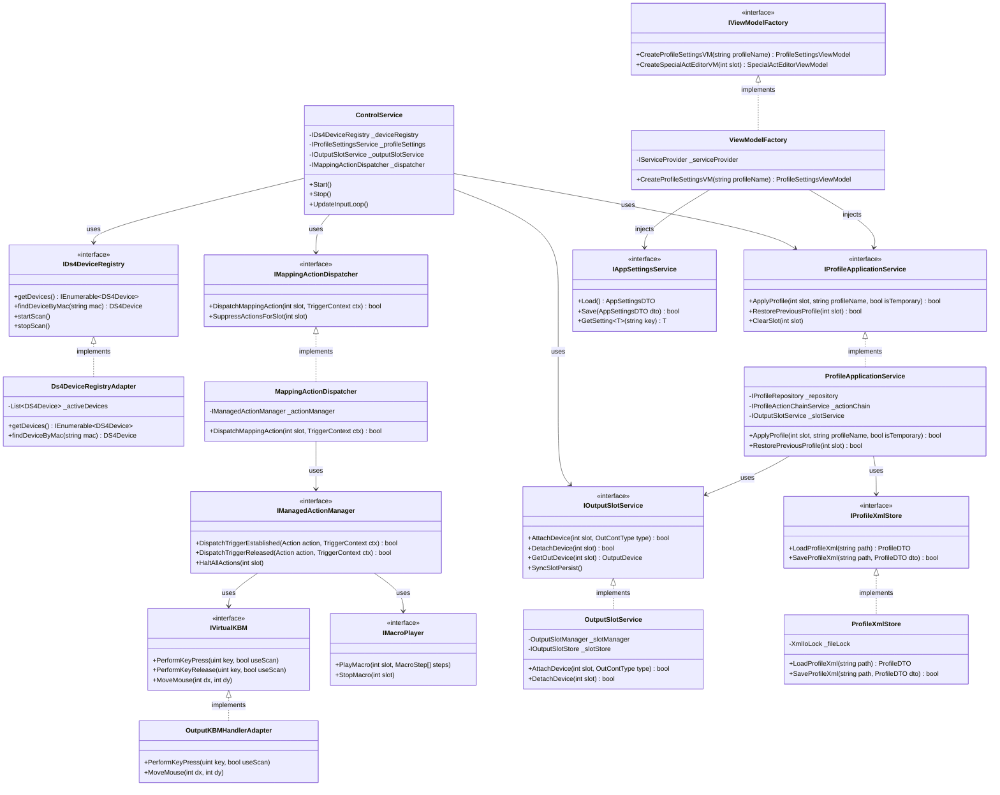

# クラス図 / インターフェース関連図
**（Class & Interface Specification）**

本ドキュメントは、DI化されたコア機能のインターフェース設計、および主要クラスの関連性を定義する。

---

## 1. 主要クラス・インターフェース関連図

---

## 2. 適用されたデザインパターン

1. **Adapter パターン:**
   * `Ds4DeviceRegistryAdapter`: レガシーな静的デバイス管理と新インターフェース `IDs4DeviceRegistry` の橋渡し。
   * `OutputKBMHandlerAdapter`: Win32ネイティブ `SendInput` および `FakerInput` を `IVirtualKBM` として統一ラップ。
2. **Abstract Factory パターン:**
   * `IViewModelFactory`: パラメータ（プロファイル名やスロット番号）を受け取って ViewModel を生成する純粋なDIファクトリ。
3. **Repository パターン:**
   * `IProfileRepository` / `ISpecialActionRepository`: ドメイン層に対してデータ永続化（XML読み書き）の詳細を隠蔽。
4. **Dispatcher パターン:**
   * `IMappingActionDispatcher`: 毎フレームの高速マッピング処理から非同期アクション（マクロ実行、プロセス起動）を分離・安全に委譲。