# クラス図 / インターフェース関連図
**（Class & Interface Specification）**

本ドキュメントは、巨大ファイルの解体および1クラス1ファイル化を反映した、DS4Windows-Vader4Pro のインターフェース構成とクラス関連性を定義する。

---

## 1. 主要クラス・インターフェース関連図

```mermaid
classDiagram
    %% ==========================================
    %% 1. 入力監視層 (Ingress)
    %% ==========================================
    class IDs4DeviceRegistry {
        <<interface>>
        +getDevices() IEnumerable~DS4Device~
        +findDeviceByMac(string mac) DS4Device
        +startScan()
        +stopScan()
    }
    class IDeviceHotplugMonitor {
        <<interface>>
        +StartMonitoring()
        +StopMonitoring()
        +DeviceArrived event
        +DeviceRemoved event
    }
    class Ds4DeviceRegistryAdapter {
        -List~DS4Device~ _activeDevices
    }
    IDs4DeviceRegistry <|.. Ds4DeviceRegistryAdapter : implements
    Ds4DeviceRegistryAdapter --> IDeviceHotplugMonitor : uses

    %% ==========================================
    %% 2. 信号変換層 (Mapping Pipeline & Processors)
    %% ==========================================
    class IInputMappingPipeline {
        <<interface>>
        +Process(int slot, ControllerInputState input, ProfileEntity profile) TransformedOutput
    }
    class IButtonProcessor {
        <<interface>>
        +ProcessButtons(ButtonInputState input, ButtonMappingConfig cfg) ButtonOutputState
    }
    class IStickProcessor {
        <<interface>>
        +ProcessStick(StickInputState input, StickConfig cfg) StickOutputState
    }
    class ITriggerProcessor {
        <<interface>>
        +ProcessTriggers(TriggerInputState input, TriggerConfig cfg) TriggerOutputState
    }
    class ITouchGyroProcessor {
        <<interface>>
        +ProcessTouchAndGyro(TouchState touch, SixAxisState gyro, MotionConfig cfg) MotionOutputState
    }
    class IMouseEngine {
        <<interface>>
        +CalculateMouseMovement(int dx, int dy, MouseConfig cfg) MouseDelta
        +ApplyFilter(OneEuroFilter filter, double val) double
    }

    class InputMappingPipeline {
        -IButtonProcessor _btnProc
        -IStickProcessor _stickProc
        -ITriggerProcessor _trigProc
        -ITouchGyroProcessor _touchGyroProc
        -IMouseEngine _mouseEngine
        -IMappingActionDispatcher _dispatcher
    }
    IInputMappingPipeline <|.. InputMappingPipeline : implements
    InputMappingPipeline o-- IButtonProcessor
    InputMappingPipeline o-- IStickProcessor
    InputMappingPipeline o-- ITriggerProcessor
    InputMappingPipeline o-- ITouchGyroProcessor
    InputMappingPipeline o-- IMouseEngine

    class IInputLoopCoordinator {
        <<interface>>
        +StartLoop()
        +StopLoop()
        +Tick()
    }
    class ControlService {
        -IDs4DeviceRegistry _deviceRegistry
        -IInputLoopCoordinator _loopCoordinator
        -IInputMappingPipeline _pipeline
        -IOutputSlotService _outputSlotService
        -IProfileApplicationService _profileAppService
        +Start()
        +Stop()
    }
    ControlService --> IDs4DeviceRegistry : uses
    ControlService --> IInputLoopCoordinator : uses
    ControlService --> IInputMappingPipeline : uses

    %% ==========================================
    %% 3. 信号出力層 (Egress)
    %% ==========================================
    class IOutputSlotService {
        <<interface>>
        +AttachDevice(int slot, OutContType type) bool
        +DetachDevice(int slot) bool
        +GetOutDevice(int slot) OutputDevice
        +SyncSlotPersist()
    }
    class IVirtualKBM {
        <<interface>>
        +PerformKeyPress(uint key, bool useScan)
        +PerformKeyRelease(uint key, bool useScan)
        +MoveMouse(int dx, int dy)
    }
    class IMacroPlayer {
        <<interface>>
        +PlayMacro(int slot, MacroStep[] steps)
        +StopMacro(int slot)
    }
    class ILightbarService {
        <<interface>>
        +ComputeColor(int slot, BatteryStatus battery, LightbarConfig cfg) DS4Color
    }
    InputMappingPipeline --> IOutputSlotService : outputs pad
    IMouseEngine --> IVirtualKBM : outputs mouse
    ControlService --> ILightbarService : updates LED

    %% ==========================================
    %% 4. UI層 (Sub-ViewModels Composition)
    %% ==========================================
    class ProfileSettingsViewModel {
        +StickSettingsSubViewModel StickSubVM
        +TriggerSettingsSubViewModel TriggerSubVM
        +ButtonMappingSubViewModel ButtonSubVM
        +SpecialActionsSubViewModel ActionSubVM
        +SaveProfile()
    }
    class StickSettingsSubViewModel {
        -IProfileSettingsService _profileSettings
    }
    class TriggerSettingsSubViewModel {
        -IProfileSettingsService _profileSettings
    }
    class ButtonMappingSubViewModel {
        -IProfileSettingsService _profileSettings
    }
    class SpecialActionsSubViewModel {
        -ISpecialActionRepository _actionRepo
    }
    ProfileSettingsViewModel *-- StickSettingsSubViewModel
    ProfileSettingsViewModel *-- TriggerSettingsSubViewModel
    ProfileSettingsViewModel *-- ButtonMappingSubViewModel
    ProfileSettingsViewModel *-- SpecialActionsSubViewModel

    class IViewModelFactory {
        <<interface>>
        +CreateProfileSettingsVM(string profileName) ProfileSettingsViewModel
    }
    class ViewModelFactory {
        -IServiceProvider _sp
    }
    IViewModelFactory <|.. ViewModelFactory : implements
    ViewModelFactory ..> ProfileSettingsViewModel : creates

    %% ==========================================
    %% 横断基盤・永続化層 (Storage)
    %% ==========================================
    class IProfileXmlStore {
        <<interface>>
        +LoadProfileXml(string path) ProfileDTO
        +SaveProfileXml(string path, ProfileDTO dto) bool
    }
    class IDeviceOptionRepository {
        <<interface>>
        +GetDeviceOptions~T~(string mac) T
        +SaveDeviceOptions~T~(string mac, T opts) bool
    }
    class XmlIoLock {
        -ReaderWriterLockSlim _lock
        +AcquireReadLock()
        +AcquireWriteLock()
    }
    class ProfileXmlStore {
        -XmlIoLock _lock
    }
    IProfileXmlStore <|.. ProfileXmlStore : implements
    ProfileXmlStore --> XmlIoLock : uses
```

---

## 2. アーキテクチャ・パターンの適用

1. **Pipeline & Filter パターン（信号変換層）：**
   * 443KBの `Mapping.cs` を、`IInputMappingPipeline`（コンテキスト統括）と5つの独立した Processor（`Button`, `Stick`, `Trigger`, `TouchGyro`, `Mouse`）に分割。各Processorは入力を受け取り、補正・変換結果を次のステージに渡す。
2. **Composite / Sub-ViewModel パターン（UI層）：**
   * 158KBの `ProfileSettingsViewModel` を親とし、関心事ごとに `StickSettingsSubVM` 等をコンポジション。各サブVMがそれぞれの設定値とUIバインディングを担当し、巨大単一ViewModelの肥大化を解消。
3. **Facade パターン（ControlService）：**
   * 旧 `ControlService.cs` が抱えていた膨大な責務（ループ制御、ホットプラグ、LED計算）を配下サービスに委譲し、自身は全体の開始・停止とオーケストレーションを司るファサードとして軽量化。
4. **Lock Wrapper パターン（基盤層）：**
   * `XmlIoLock` が `ReaderWriterLockSlim` をカプセル化し、複数スレッドからのXML設定ファイル読み書き時のデッドロックおよび競合を完全に防護。