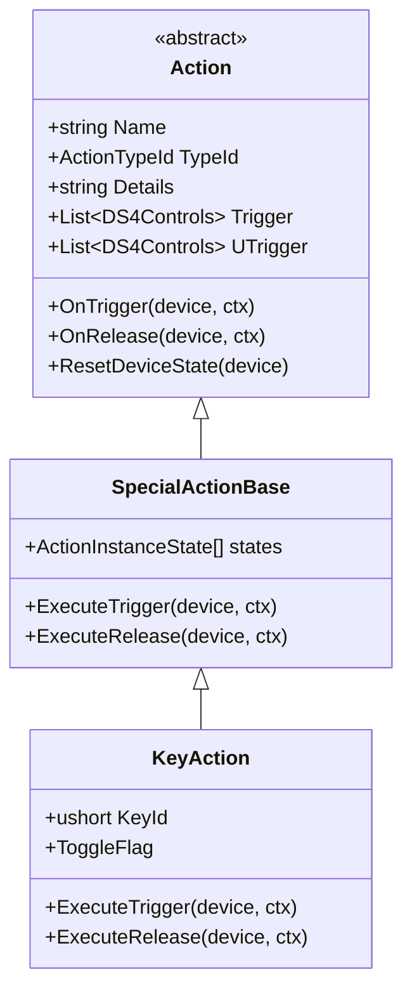
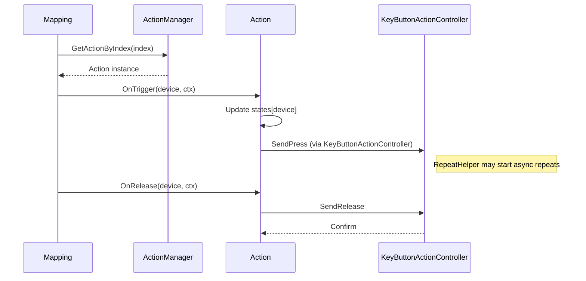

## 具体的な Action クラス仕様（各型のプロパティ／メソッド詳細）

以下は現状の実装で提供されている全ての SpecialAction 型を新しい `Action` クラス構造で再現するための詳細仕様です。各項は実装時に `SpecialAction` (ScpUtil.SpecialAction) から `ActionFactory` を通じて変換されることを想定します。

### 共通（`Action` / `SpecialActionBase`）
- プロパティ（必須）: `string Name`, `SpecialAction.ActionTypeId TypeId`, `string Details`, `string Extra`, `List<DS4Controls> Trigger`, `List<DS4Controls> UTrigger`, `double DelayTime`, `bool PressRelease`
- 状態: `ActionInstanceState[] states` (長さ = `Global.MAX_DS4_CONTROLLER_COUNT`)
- メソッド（必須）: `void OnTrigger(int device, MappingContext ctx)`, `void OnRelease(int device, MappingContext ctx)`, `void ResetDeviceState(int device)`, `ActionInstanceState GetState(int device)`

### `BasicAction`（既存の基本マップ: outputfieldMapping を直接操作）
- 追加プロパティ: `X360Controls? OutputControl`, `MouseMapping? MouseOutput`, `bool OutputTouchpad` 等
- OnTrigger: `ctx.OutputFieldMapping` を直接更新して出力を設定
- OnRelease: 出力を元に戻す（必要な場合のみ）

### `KeyAction` (ActionTypeId.Key)
- プロパティ: `ushort KeyId`, `DS4KeyType KeyFlags`（ScanCode/Repeat/Toggle）、`KeyButtonSwitchModeEnum SwitchMode`（Press|Toggle）、`bool FirstTouchBehavior`, `bool KeepKeyState`
- `ActionInstanceState` 内フィールド: `bool PressedOnce`, `long LastToggleTimeUtcTicks`, `SyntheticState.KeyPresses KeyState`
- ExecuteTrigger / OnTrigger の振る舞い:
  - `SwitchMode == Toggle` のとき: `PressedOnce` と `LastToggleTimeUtcTicks` を用いたデバウンス + トグル反転を行い、`KeyButtonActionController` に合成送出委譲。
  - `SwitchMode == Press` のとき: `SendPress` を呼び、リリースは `OnRelease` で送る。
  - 決定: `RepeatHelper` の利用はコントローラ側（例: `KeyButtonActionController`）に統一します。`Action` 側は合成送出をコントローラに委譲し、連続送信の開始/停止やライフサイクル管理（Stop/Dispose）はコントローラが責任を持ちます。アクション実装側で独自にリピータを実装しないことで、重複実装を避けます。
- ExecuteRelease / OnRelease: `SendRelease`（必要に応じ）・`PressedOnce` 解除ロジック（`ShouldClearPressedOnce` 判定）

### `ButtonAction` (ActionTypeId.Button)
- プロパティ: `int ButtonId`（details）、`KeyButtonSwitchModeEnum SwitchMode`
- 動作:
  - 基本は `ctx.OutputFieldMapping.buttons[ButtonId]` を更新して X360 出力を行う。
  - `KeyButtonActionController` を使う合成パスが現行コードに存在するため、Action は必要なら委譲する。
  - Toggle/Press の扱いは `KeyAction` と同様に `PressedOnce` を持てる。

### `MacroAction` (ActionTypeId.Macro)
- プロパティ: `List<int> MacroIds`, `bool PressRelease`, `bool Synchronized`, `bool KeepKeyState`, `bool RepeatMacro`
- 状態: `bool MacroPlaying`, `int CurrentStep` 等
- 実行:
  - ExecuteTrigger: マクロ再生を開始（`Synchronized` がある場合は再生完了を待つ）。`PressRelease` と `firstTouch` の組合せは既存の条件に一致させる。
  - ExecuteRelease: `PressRelease` の場合はリリース側のマクロを実行。
  - Abort/Reset: 中断や完了後のキー解放（`KeepKeyState` に注意）

### `ProfileAction` (ActionTypeId.Profile)
- プロパティ: `string ProfileName`, `bool UseTempProfile`, `bool AutomaticUntrigger`, `string PrevProfileName`
- ExecuteTrigger: `ProfileManager.ApplyProfile(ProfileName, device, UseTempProfile)` を呼ぶ（既存の ApplyProfile ロジックを利用）。
- ExecuteRelease: `AutomaticUntrigger` が真なら元のプロファイルに戻す等の処理。

### `ProgramAction` (ActionTypeId.Program)
- プロパティ: `string ProgramPath`, `string Arguments`, `bool RunOnRelease`（extras）
- 実行: `Process.Start` で起動。Release 発生時に起動する挙動は `RunOnRelease` で制御。

### `DisconnectBTAction` (ActionTypeId.DisconnectBT)
- プロパティ: `string Details`（必要に応じデバイス識別）
- 実行: 既存の切断 API を呼び出す。`pressRelease` に依存する場合は release タイミングで実行。

### `BatteryCheckAction` (ActionTypeId.BatteryCheck)
- プロパティ: `string[] Parameters`（閾値や表示オプション）
- 実行: バッテリチェックルーチン呼び出し／ログ出力。UI 表示がある場合は Dispatcher 経由で処理。

### `MultiAction` / `XboxGameDVR`（複合アクション）
- プロパティ: `List<ActionDescriptor>`（内部で実行する複数アクションの記述）
- 実行: 内部列のアクションを順次（あるいは並列）実行。`XboxGameDVR` は `MultiAction` に変換して扱う。

### `SASteeringWheelEmulationCalibrate` / `GyroCalibrate`
- 小規模専用アクションで、デバイス較正ルーチンを呼び出す。例: `CalibrateSteeringWheel(device)`。

---

この追記により、既存の `SpecialAction` が表現している全振る舞いを新しい `Action` 系で再現できることを文書化しました。ソースへの移植を行う場合、次は `ActionFactory.CreateFrom(SpecialAction sa)` と `KeyAction` の最小スタブ実装および `Mapping` 側の並列呼び出しパスを作成するのが自然な第一歩です。

# Action クラス設計仕様書

目的
- 既存の SpecialAction 実装を踏まえ、`Action` 基底と `BasicAction`/`SpecialAction` 派生群を含むオブジェクト指向設計を定義する。
- 設計書は実装前の合意文書として利用する。まずは現状の SpecialAction 種類のみを取り込み、拡張性と互換性を保つ。

範囲pressedonce[key]：toggle 反転時に true にセットされ、トリガが完全に解除（かつ ShouldClearPressedOnce 判定を満たす）されると false に戻る。これが連続したトグル反転を抑止する役割。
- 対象: 既存の `Mapping.cs` に現れる SpecialAction ロジック（Key, Button, Macro, MultiAction 等）をクラス化する。
- 目的外: UI 層、プロファイルの永続化仕様の細部（ただし移行プランは含む）。

用語
- Action: 基底概念。BasicAction（基本マップで使われる単発出力）と SpecialAction（トリガ/複雑ロジックを持つ）に分かれる。
- InstanceState: 各 Action がデバイス（controller）毎に保持する実行状態。

高レベル設計
- `Action`（抽象基底）
  - 役割: トリガ通知を受け取り OnTrigger/OnRelease を実行する共通 API を定義する。
  - 主要 API:
    - `void OnTrigger(int device, MappingContext ctx)`
    - `void OnRelease(int device, MappingContext ctx)`
    - `void ResetDeviceState(int device)`
    - `ActionInstanceState GetState(int device)`
  - 共通プロパティ:
    - `string Name`
    - `ActionTypeId TypeId`（enum: Basic, Key, Button, Macro, MultiAction, DisconnectBT, BatteryCheck, ...）
    - `string Details`（設定中の `action.details` 生文字列）
    - `List<DS4Controls> Trigger`, `List<DS4Controls> UTrigger`（トリガ／アンチトリガ）

- `BasicAction : Action`
  - 用途: コントローラーの単発ボタン等、Mapping のフォールバックで直接 `outputfieldMapping` を更新する処理を包む。
  - 主要プロパティ: `X360Controls OutputControl` など。
  - `OnTrigger` は `MappingContext.OutputFieldMapping` に対し直接書き込みを行う（既存のフォールバック処理を移動）。

- `SpecialActionBase : Action`
  - 目的: SpecialAction 固有の共通ロジック（actionDone 管理や uTrigger/untriggerindex 処理、ログ）をまとめる。
  - 内部: `ActionInstanceState[] states`（長さ = `Global.MAX_DS4_CONTROLLER_COUNT`）
  - 主要メソッド:
    - `protected virtual void ExecuteTrigger(int device, MappingContext ctx)`
    - `protected virtual void ExecuteRelease(int device, MappingContext ctx)`
  - これをさらに派生して各種 SA を実装する。

- 派生: `KeyAction`, `ButtonAction`, `MacroAction`, `MultiAction`, `DisconnectBTAction`, `BatteryCheckAction` 等。
  - `KeyAction` の主な振る舞い:
    - `Details` を `ushort KeyId` にパースして保持。
    - Toggle フラグ（`DS4KeyType.Toggle`）に基づく toggle/press ロジック。
    - デバウンスは `states[device].LastToggleTimeUtcTicks` を用いる。
    - 合成キー送出は `KeyButtonActionController`（既存）を利用して `OnSATriggerEstablished/Released` 相当の呼び出しを行う。
    - `InstanceState` に `pressedOnce` 相当のフラグを保持（デバイス毎、Action 単位）。
  - `ButtonAction` の主な振る舞い:
    - `Details` を `X360Controls` またはマウス操作に解釈。
    - 必要に応じ `outputfieldMapping` を更新、あるいは `TryDispatchSATriggerEstablished` を通す。
  - `MacroAction`:
    - `Details` はマクロのパラメータ（`262/400/...`）として解析。
    - `Extras`（Repeat 等）に従って `PlayMacro` を呼ぶ。

データ構造
- ActionInstanceState
  - フィールド例:
    - `bool ActionDone` — Mapping の `actionDone[index].dev[device]` と同等
    - `bool PressedOnce` — 現在の `pressedonce` の SA版
    - `long LastToggleTimeUtcTicks`
    - `SyntheticState.KeyPresses KeyState`（必要に応じ）
    - `object Misc`（派生専用の補助データ）

- MappingContext
  - Mapping から送られる補助情報をまとめる構造体
    - `DS4State cState`, `DS4State eState`, `VirtualKBMBase OutputKBMHandler`, `DS4StateFieldMapping OutputFieldMapping`, その他必要情報

ActionManager
- 役割: プロファイルから `Action` インスタンス群を生成・保持し、名前/インデックス検索を提供。
- API:
  - `IReadOnlyList<Action> Actions`（順序は既存の index に対応）
  - `Action GetActionByIndex(int index)`
  - `Action GetActionByName(string name)`
  - `void ResetAllDeviceStates(int device)`
  - `void LoadFromProfile(Profile p)`（Factory を呼ぶ）

Factory
- `ActionFactory.Create(SpecialActionConfig cfg)` のような静的メソッドで、`cfg.typeID` に基づいて適切な派生クラスを生成して `Details` 等をパースする。

Mapping との連携（呼び出しフロー）
- 既存 Mapping のトリガ検出ループは当面残す。
- トリガ検出後の差し替え呼び出し:
  - 旧: `TryDispatchSATriggerEstablished(action, device, key, ...)` / `TryDispatchSATriggerReleased(...)`
  - 新: `var sa = ActionManager.GetActionByIndex(index); sa.OnTrigger(device, mappingContext);`（リリースは `OnRelease`）
- 既存 `TryDispatch` 系は内部で再利用しても良い（互換ラッパ）。

ログ設計
- 各 Action はログで自身を `[Action:<index>|<name>]` プレフィックスで出力。
- ログイベント: `Triggered`, `Released`, `ToggleFlipped`, `SyntheticSent`, `SyntheticReleased`。

シリアライズ／互換性
- 既存プロファイルフォーマット（XML/JSON）→ 新 `Action` オブジェクトのマッピングを Factory で実装。
- 一時的に `Mapping` 側で old-style ロジックを残し、段階的に切替えを行う。

並行性とスレッド安全
- `ActionInstanceState[] states` は Mapping ループ（シングルスレッドで実行される想定）からのみ更新されるが、`RepeatHelper` などの非同期処理が SyntheticDispatcher を介して実行する場合がある。
- `states` 配列へのアクセスは保護オブジェクト（`lock`）または `volatile`/`Interlocked` を使い最小限の同期を施す。

テスト項目
- KeyAction (Press/Toggle/ScanCode) の単体動作ケース
- 複数 SA が同一 Details（同一出力キー）を使う場合の独立性確認
- MacroAction のパラメータ解釈と Repeat 動作
- Mapping 側での逐次移行テスト（旧ロジックと新ロジックを並列で比較）

移行計画（推奨）
1. ドキュメント合意 → `SpecialActionBase` と `KeyAction` の最小実装を追加（Mapping に並列パス）。
2. 実機で KeyAction の動作確認 → Button/Macro を順次移行。
3. すべて移行後に旧グローバル状態（`pressedonce` 等）と重複コードを除去。

付録: 主要 API シグネチャ（サンプル）
```csharp
public abstract class Action
{
    public string Name { get; }
    public ActionTypeId TypeId { get; }
    public string Details { get; }
    public List<DS4Controls> Trigger { get; }
    public List<DS4Controls> UTrigger { get; }

    public abstract void OnTrigger(int device, MappingContext ctx);
    public abstract void OnRelease(int device, MappingContext ctx);
    public abstract void ResetDeviceState(int device);
}

public class KeyAction : SpecialActionBase
{
    public ushort KeyId { get; }
    protected override void ExecuteTrigger(int device, MappingContext ctx) { /* toggle/press logic */ }
    protected override void ExecuteRelease(int device, MappingContext ctx) { /* release logic */ }
}
```

---

次の推奨アクション
- まず `KeyAction` のプロトタイプ実装を作り、Mapping に並列ルートを追加して動作検証を行う。

必要ならこの仕様書をさらに図付き（クラス図／シーケンス図）で拡張します。どの追加情報が欲しいです？





````
