# DS4Windows 導入ガイド

## 目次
1. [DS4Windowsとは](#ds4windowsとは)
2. [システム要件](#システム要件)
3. [インストール手順](#インストール手順)
4. [初回セットアップ](#初回セットアップ)
5. [コントローラーの接続](#コントローラーの接続)
6. [基本的な使い方](#基本的な使い方)
7. [トラブルシューティング](#トラブルシューティング)

---

## DS4Windowsとは

DS4Windowsは、PlayStation 4/5のDualShock 4およびDualSenseコントローラーをWindows PCで使用するためのオープンソースソフトウェアです。

### 主な機能
- **Xbox 360コントローラーのエミュレーション**: Xbox対応ゲームでPS4/PS5コントローラーを使用可能
- **カスタマイズ可能なボタンマッピング**: ボタン配置を自由にカスタマイズ
- **プロファイル機能**: ゲームごとに異なる設定を保存・自動切替
- **タッチパッドのマウス操作**: タッチパッドをマウスとして使用
- **ライトバーのカスタマイズ**: 好みの色に変更可能
- **マクロ・特殊アクション**: 複雑な操作を自動化

---

## システム要件

### 最小要件
- **OS**: Windows 10 (64bit) 以降
- **.NET**: .NET 8.0 Runtime (Desktop) 以降
- **アーキテクチャ**: x64 (64bit)
- **RAM**: 2GB以上推奨
- **接続方式**: USB接続またはBluetooth 4.0以降

### 対応コントローラー
- DualShock 4 (CUH-ZCT1, CUH-ZCT2)
- DualSense (CFI-ZCT1)
- DualSense Edge

---

## インストール手順

### 1. 前提条件の確認

#### .NET 8.0 Runtimeのインストール
1. [Microsoft公式サイト](https://dotnet.microsoft.com/download/dotnet/8.0)にアクセス
2. 「.NET Desktop Runtime 8.0.x」の「x64」版をダウンロード

3. インストーラーを実行してインストール

#### Visual C++ 再頒布可能パッケージのインストール
1. [Microsoft公式サイト](https://aka.ms/vs/17/release/vc_redist.x64.exe)から最新版をダウンロード
2. インストーラーを実行してインストール

### 2. DS4Windowsのダウンロード

1. [GitHubリリースページ](https://github.com/gwin7ok/DS4Windows-Vader4Pro/releases)にアクセス
2. 最新バージョンの`DS4Windows_x.x.x_x64.zip`をダウンロード
3. ZIPファイルを任意のフォルダに解凍
   - **推奨**: `C:\Program Files\DS4Windows`
   - **注意**: 日本語を含むパスは避けてください

### 3. 初回のDS4Windows.exeの起動
1. `DS4Windows.exe`を初めて起動すると、`Profiles.xml`が存在しない場合、以下のウィンドウが順に表示されます。
   - 言語選択: 「日本語」を選択して「OK」をクリック
   
   - 設定ファイルの保存先選択:
     - Program Folder: 設定ファイルをインストールフォルダ（例: `C:\Program Files\DS4Windows`）に保存します。管理者権限での実行が必要になる場合があります。
     - Appdata: ユーザー設定フォルダ（`%AppData%\DS4Windows`）に保存します
   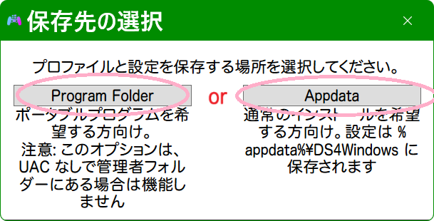
   - コントローラー選択: 使用するコントローラーにチェックを入れて「閉じる」をクリック
   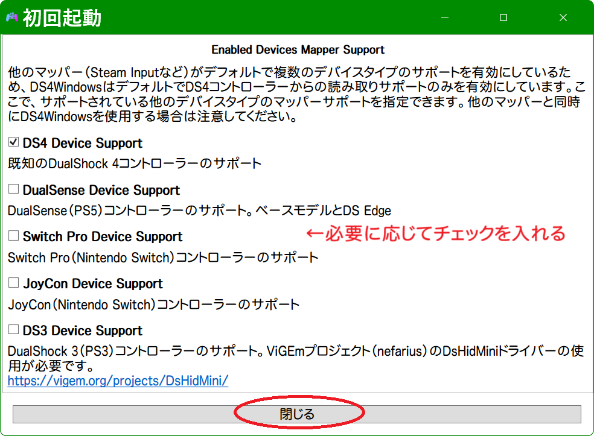
2. 必要なドライバーが未インストールの場合、「DS4Windowsへようこそ」画面が表示されます。
   - Step 1: ViGEmBusドライバーをインストール
   - Step 4: （オプション）HidHideドライバーをインストール
   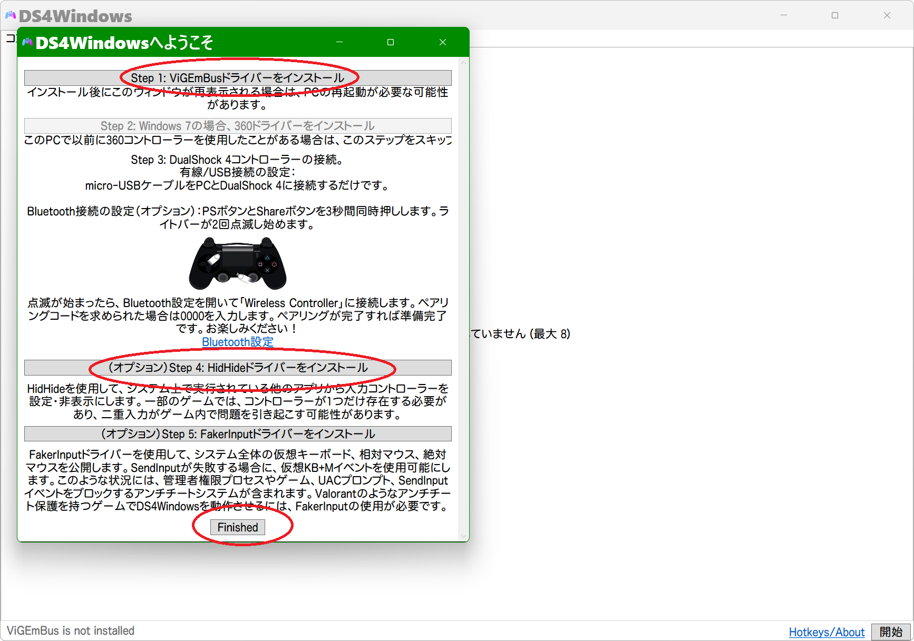
   - ※HidHideをインストールした場合は、インストール後にOSの再起動が必要です
3. 再起動後、DS4Windowsを再度起動して次の手順へ進んでください。

以下は DualShock 4 コントローラーを例に、DS4Windowsで仮想コントローラーとしてゲーム側に認識させる手順の説明です。

### 4.HidHideの設定
*この設定がないとDS4Windowsを使用したときにゲーム側から
・PCに接続したコントローラー本体
・DS4Windowsが出力する仮想コントローラー
の2つが認識される形になるので、PCに接続したコントローラー本体を隠す設定を行います

1. DS4Windowsの「設定」タブ内「HidHide 設定クライアント」リンクから、HidHide 設定クライアントを起動します。

2. 「Applications」タブ右下の「+」ボタンから
   - `DS4Windows.exe`（通常は`C:\Program Files\DS4Windows\DS4Windows.exe`）を追加
   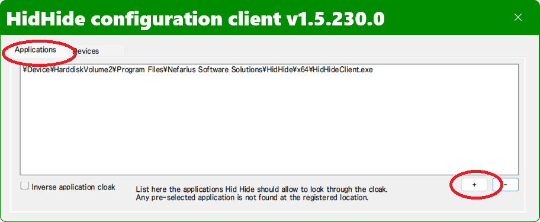
   - `HidHideClient.exe`と合わせて2つが登録されている状態にします
   
   - ※登録したアプリはHidHideで隠されたコントローラーを例外として認識可能です
3. DS4Windowsを起動した状態でコントローラー（DualShock 4）をPCに接続します（接続方法は [コントローラーの接続](#コントローラーの接続)を参照してください）。
   - DS4Windowsを再起動するか右下の「開始」ボタンを押してDS4Windowsの機能を開始する
   
   - 「Controllers」タブに接続されたコントローラーが表示されることを確認
   
   - 「設定」タブの「Utils」枠内「コントロールパネル」からゲームコントローラーの設定を開き、以下2つが表示されていることを確認
   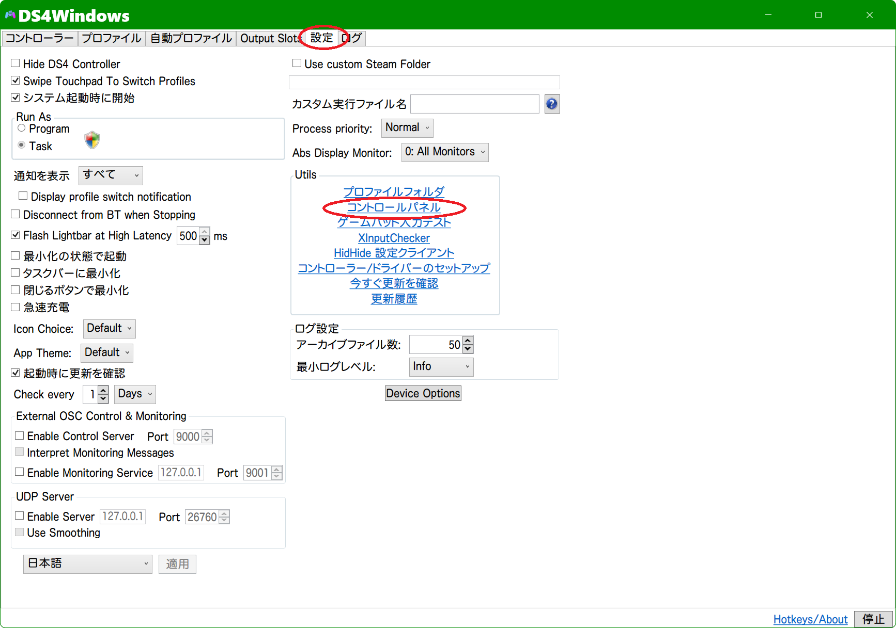
     - Wireless Controller（接続されたコントローラー本体）
     - Controller (XBOX 360 For Windows)（DS4Windowsが出力する仮想コントローラー）
   
4. DS4Windowsの右下「停止」ボタンをクリックします。

   - ゲームコントローラーの設定で「Wireless Controller」だけが表示されることを確認
   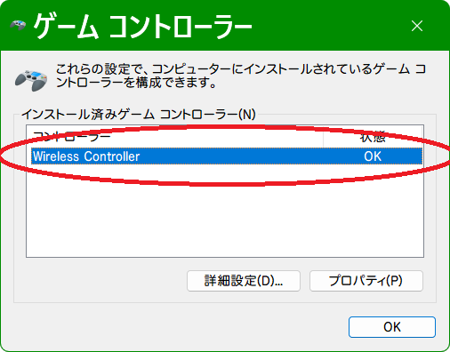
5. HidHide 設定クライアントの「Devices」タブで
   - 接続されたコントローラー本体(Sony Interactive Entertainment Wireless Controller)の左側にチェック
   - 「Enable device hiding」にもチェック
   
   - ゲームコントローラーの設定で何も表示されなくなることを確認   
   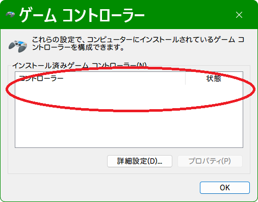
   - HidHide 設定クライアントを閉じます
6. DS4Windowsの右下「開始」ボタンをクリックします。
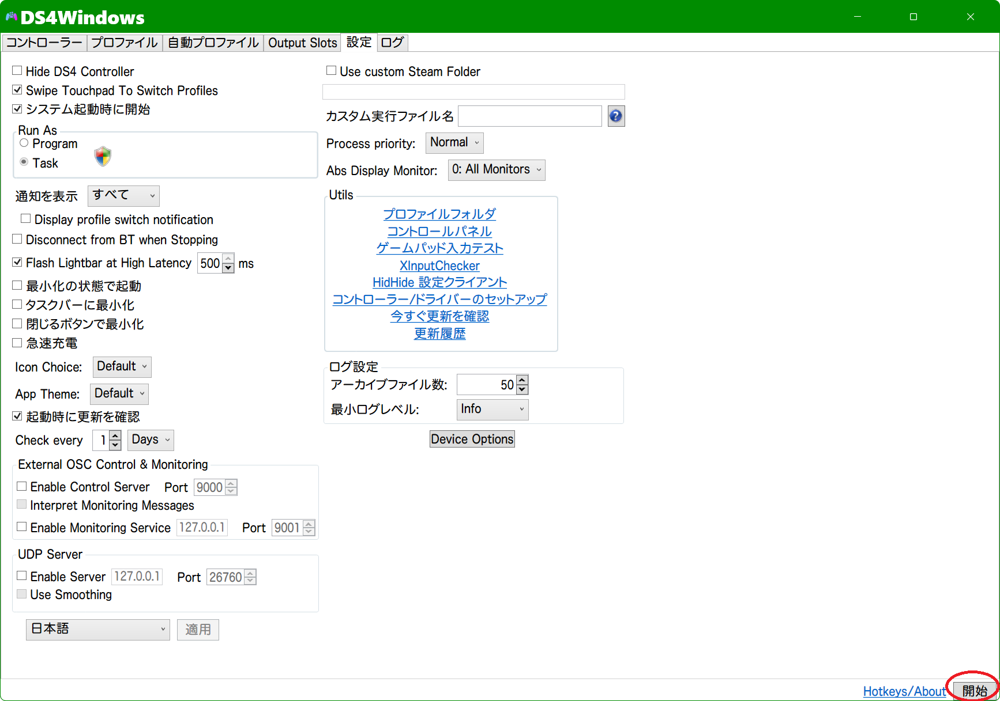
   - 「Controllers」タブにコントローラーが表示されることを確認
   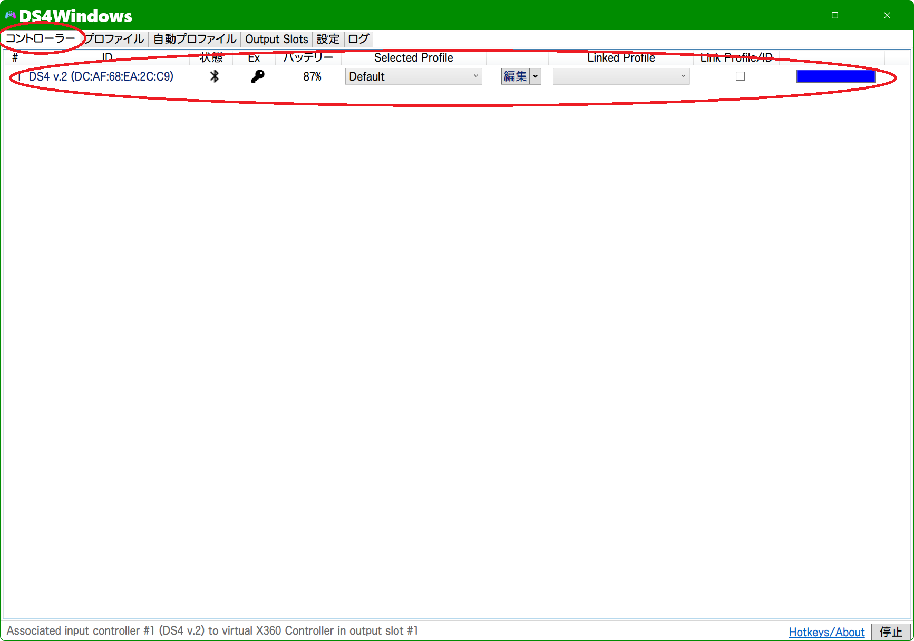
   - ゲームコントローラーの設定で「Controller (XBOX 360 For Windows)」のみ表示されていれば設定成功です
   
   - ゲームコントローラーの設定を「OK」で閉じます
   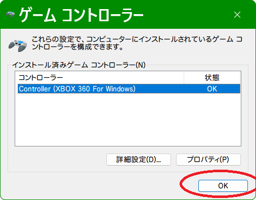
   - HideHide 設定クライアントを閉じます
   

### 5.DS4Windowsのデフォルトプロファイルの設定変更
1. 「Controllers」タブで接続されたコントローラーの行にある「編集」ボタンをクリックします。

2. プロファイル編集画面右側の「Other」タブをクリックします。
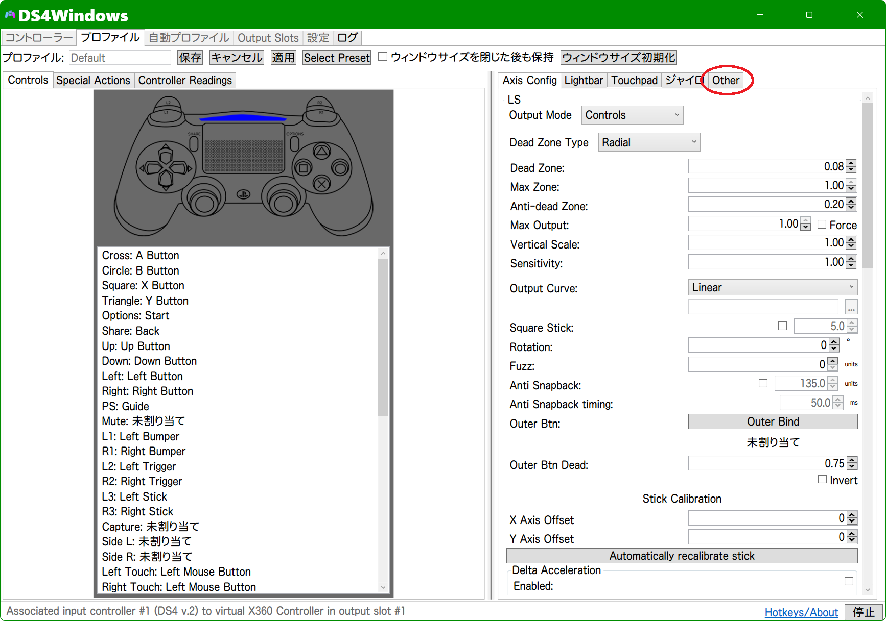
3. 「Emulated Controller」を「DualShock 4」に変更します。

4. 左上の「保存」ボタンをクリックしてデフォルトプロファイルを保存します。

5. 「設定」タブの「Utils」枠内「コントロールパネル」からゲームコントローラーの設定を開きます。

   - 「Wireless Controller」のみ表示されていれば設定成功です
   - ゲーム側で DualShock 4 として認識されます
   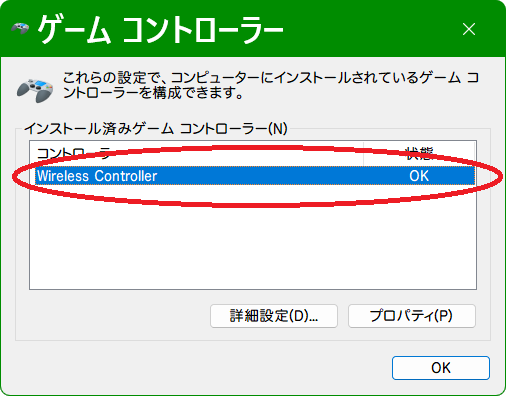
   - ゲームコントローラーの設定を「OK」で閉じます
   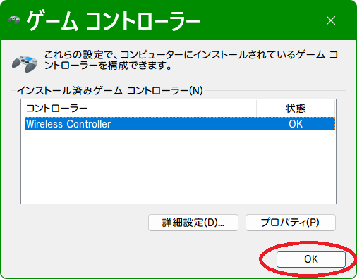

## コントローラーの接続

### USB接続（推奨：初回セットアップ時）

1. USBケーブルでコントローラーをPCに接続
2. DS4Windowsが自動的にコントローラーを認識
3. メイン画面の「Controllers」タブに表示される

### Bluetooth接続

#### ペアリング手順
1. **コントローラー側**:
   - DualShock 4: `PSボタン` + `SHAREボタン`を同時に3秒以上長押し
   - DualSense: `PSボタン` + `クリエイトボタン`を同時に3秒以上長押し
   - ライトバーが点滅を開始

2. **PC側**:
   - Windows設定を開く（`Win + I`）
   - 「デバイス」→「Bluetoothとその他のデバイス」
   - 「Bluetoothまたはその他のデバイスを追加する」をクリック
   - 「Bluetooth」を選択
   - 「Wireless Controller」を選択してペアリング

3. **DS4Windows側**:
   - コントローラーが自動的に認識され、「Controllers」タブに表示される

#### Bluetooth接続のトラブルシューティング
- **接続が不安定な場合**: USBで一度接続してから再度Bluetoothでペアリング
- **二重入力が発生する場合**: HidHideをインストール（上記参照）
- **遅延が気になる場合**: USB接続を推奨

---

## 基本的な使い方

### プロファイルの作成

1. 「Profiles」タブを開く
2. 「New」ボタンをクリック
3. プロファイル名を入力（例: "FPS用"、"レース用"）
4. 「Save」をクリック

### ボタンマッピングの変更

1. 変更したいプロファイルを選択
2. 「Edit」ボタンをクリック
3. プロファイルエディタが開く
4. 変更したいボタンをクリック
5. 割り当てたい機能を選択
   - **コントローラーのボタン**: Xbox形式のボタン
   - **キーボード**: キーを割り当て
   - **マウス**: マウスボタン・動作を割り当て
   - **マクロ**: 複数の操作を自動実行
6. 「Save」をクリックして保存

### プロファイルの切り替え

#### 手動切り替え
1. 「Controllers」タブで対象のコントローラーを選択
2. 「Selected Profile」ドロップダウンから使用するプロファイルを選択

#### 自動切り替え（Auto Profiles）
1. 「Auto Profiles」タブを開く
2. 「Add」ボタンをクリック
3. プログラム名またはウィンドウタイトルを指定
4. 適用するプロファイルを選択
5. 「Save」をクリック

対象のアプリケーションがアクティブになると、自動的にプロファイルが切り替わります。

### ライトバーの色変更

1. プロファイルエディタを開く
2. 「Lightbar」タブを選択
3. カラーピッカーで好みの色を選択
4. バッテリー残量に応じた色変更も設定可能

### タッチパッドの設定

1. プロファイルエディタを開く
2. 「Touchpad」セクションを選択
3. 以下の設定が可能:
   - **マウスモード**: タッチパッドをマウスとして使用
   - **ボタンマッピング**: タッチパッドクリックに機能を割り当て
   - **ジェスチャー**: スワイプ操作を設定

---

## トラブルシューティング

### コントローラーが認識されない

#### 確認事項
1. **USBケーブルの確認**: データ転送対応ケーブルを使用しているか
2. **Bluetoothの確認**: Bluetooth 4.0以上に対応しているか
3. **ドライバーの確認**: デバイスマネージャーで不明なデバイスがないか確認

#### 対処方法
1. DS4Windowsを管理者権限で実行
2. Windowsを再起動
3. コントローラーをUSBで接続し、リセットボタン（背面の小さな穴）を押す
4. 最新版のDS4Windowsを使用しているか確認

### 二重入力が発生する

**症状**: ゲーム内でコントローラー入力が二重に認識される

**対処方法**:
1. HidHideをインストール（上記「ドライバーのインストール」参照）
2. DS4Windows設定の「その他」タブで「HidGuardianを有効化」をチェック
3. PCを再起動

### 入力遅延が気になる

**対処方法**:
1. USB接続を使用（Bluetoothより低遅延）
2. プロファイルエディタで「Output Curve」を「Linear」に設定
3. Windows設定で「ゲームモード」を有効化
4. 「設定」→「その他」で「UDP Server」を無効化

### ゲームでコントローラーが認識されない

**確認事項**:
1. DS4Windowsが起動しているか
2. コントローラーがDS4Windowsで認識されているか
3. プロファイルが適用されているか

**対処方法**:
1. Steamの場合: Steam設定で「PlayStation設定サポート」を**無効化**
2. ゲームを起動する前にDS4Windowsを起動
3. 「設定」→「その他」で「仮想コントローラーを隠す」を無効化

### バッテリーの持ちが悪い

**対処方法**:
1. ライトバーの明るさを下げる
2. タッチパッドを無効化
3. Bluetoothではなく必要時のみUSB接続
4. DS4Windows設定で「アイドル時の切断」を有効化

### マクロの作成

1. 「Special Actions」で「Macro」を選択
2. 記録したい操作を設定:
   - キー/ボタンの順序
   - 各操作の待機時間
3. トリガーとなるボタンを設定

### 複数コントローラーの管理

DS4Windowsは最大4台のコントローラーを同時に管理できます:

1. 「Controllers」タブで各コントローラーを確認
2. それぞれ異なるプロファイルを割り当て可能
3. 「Linked Profile」でコントローラーごとの固定プロファイルを設定

---

## よくある質問（FAQ）

### Q1: DS4Windowsは無料ですか？
**A**: はい、完全に無料でオープンソースです。

### Q2: DualSenseの特殊機能（アダプティブトリガーなど）は使えますか？
**A**: 基本的な入力は可能ですが、アダプティブトリガーやハプティックフィードバックは完全には対応していません。

### Q3: ゲームごとに自動でプロファイルを切り替えたい
**A**: 「Auto Profiles」機能を使用してください（上記「自動切り替え」参照）。

### Q4: コントローラーを複数台使いたい
**A**: 最大4台まで同時接続可能です。各コントローラーに異なるプロファイルを割り当てられます。

### Q5: DS4Windowsを自動起動したい
**A**: 
1. DS4Windowsのショートカットを作成
2. `Win + R`で`shell:startup`を実行
3. スタートアップフォルダにショートカットを配置

### Q6: バッテリー残量を確認したい
**A**: メイン画面の「Controllers」タブに表示されます。ライトバーの色で残量を表示する設定も可能です。

---

## サポート・コミュニティ

### 公式リソース
- **GitHub**: https://github.com/gwin7ok/DS4Windows-Vader4Pro
- **Issue報告**: https://github.com/gwin7ok/DS4Windows-Vader4Pro/issues
- **Wiki**: https://github.com/gwin7ok/DS4Windows-Vader4Pro/wiki

### 問題報告時の情報
以下の情報を添えると解決が早くなります:
- DS4Windowsのバージョン
- Windowsのバージョン
- コントローラーのモデル
- 接続方式（USB/Bluetooth）
- エラーメッセージ（ログファイルの内容）

---

## ライセンス

DS4Windowsは[GNU General Public License v3.0](https://www.gnu.org/licenses/gpl-3.0.html)の下で配布されています。

---

**更新日**: 2025年12月10日  
**対応バージョン**: DS4Windows v3.11.5以降
